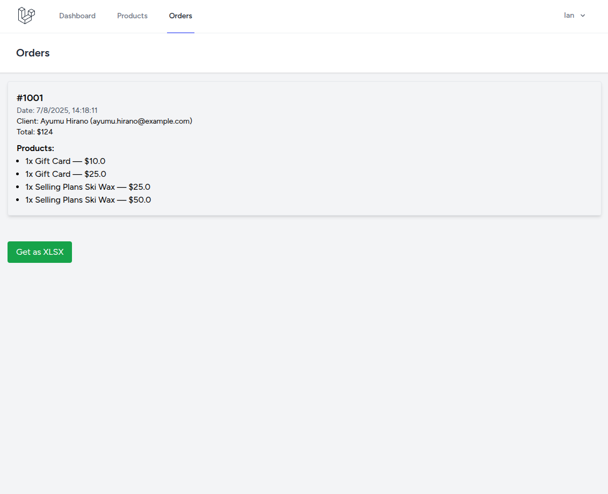
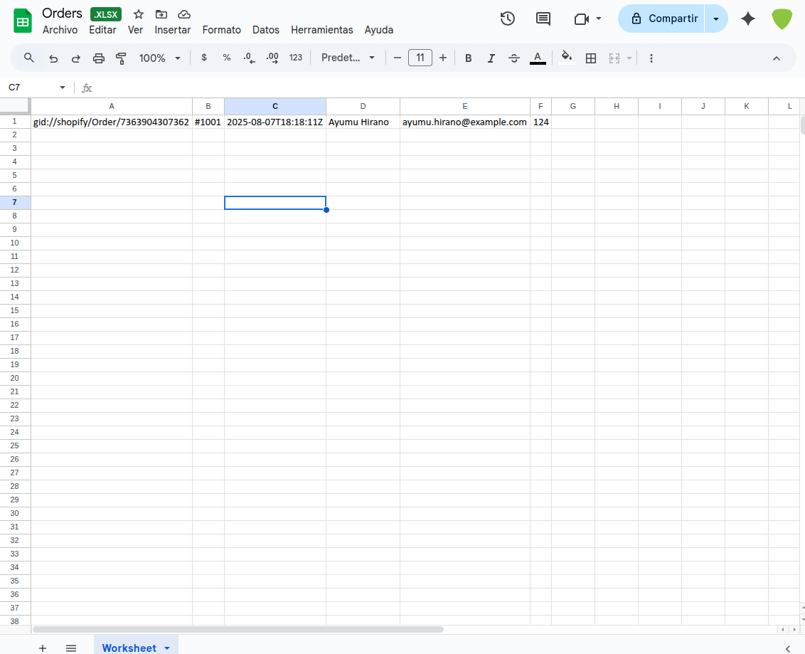

# Storefront

[](https://codecov.io/gh/Zen0x7/Storefront)

## Requirements

- PHP >= 8.4
- Node >= 20

You must have the following php modules:

```
[PHP Modules]
bcmath
calendar
Core
ctype
curl
date
dom
exif
FFI
fileinfo
filter
ftp
gd
gettext
hash
iconv
json
libxml
mbstring
mysqli
mysqlnd
openssl
pcntl
pcov
pcre
PDO
pdo_mysql
Phar
posix
random
readline
Reflection
session
shmop
SimpleXML
sockets
sodium
SPL
standard
sysvmsg
sysvsem
sysvshm
tokenizer
xdebug
xml
xmlreader
xmlwriter
xsl
zip
zlib

[Zend Modules]
Xdebug
```

## Instructions

Follow these steps to run the project manually:

### 1. Clone the repository

```bash
git clone https://github.com/Zen0x7/Storefront.git
cd Storefront
```

### 2. Install dependencies

```bash
composer install
yarn
yarn build
```

### 3. Setup environment variables

```bash
cp .env.example .env
php artisan key:generate
php artisan migrate
```

> You don't need use MySQL or MariaDB as this uses sqlite as default.

### 4. Configure shopify credentials

Open your `.env` file and set the following variables:

```dotenv
SHOPIFY_URL=https://your-store.myshopify.com
SHOPIFY_TOKEN=your_private_access_token
```

- SHOPIFY_URL: Your full Shopify store URL
- SHOPIFY_TOKEN: Admin access token from a custom app

> ### How to generate your Shopify token (SHOPIFY_TOKEN)
>
> 1. Log into your Shopify store
> 2. Go to Apps > Develop apps > Create an app 
> 3. Enter a name and create a new custom app
> 4. Under the Configuration tab, grant the following Admin API scopes:
>    - read_products
>    - read_orders
>    - read_customers
> 5. Save, go to API credentials, and copy the Admin API access token (you’ll only see it once)
>
> Official guide:
> [How to create a custom app in Shopify](https://help.shopify.com/en/manual/apps/app-types/custom-apps)

### 5. Start the Laravel server

```bash
php artisan serve --port=8000
```

Visit http://localhost:8000 to use the app.

## How to Use

Open your browser and go to:

### Register a new user
http://localhost:8000/register

### Login with your credentials
http://localhost:8000/login

After logging in, you can access:

### 📦 Products page
http://localhost:8000/products

- Displays a list of products with their image, title, SKU, and price.
- Includes a "Get as XLSX" button to export the data.

### 🧾 Orders page
http://localhost:8000/orders

- Displays recent orders with customer details and line items.
- Includes a "Get as XLSX" button to export the data.

## Features

- User authentication (Laravel Breeze + Inertia + Vue)
- Connects to a Shopify store via Admin API (GraphQL, no SDK)
- Secure access token stored via `.env` (no hardcoded secrets)
- Fetches all products (paginated) using Shopify GraphQL
- Fetches all orders from the last 30 days (paginated)
- Displays products and orders in a Vue frontend
- Export products and orders to Excel (.xlsx)
- Simple and clean UI using Tailwind + Inertia
- Tests using Pest for:
    - ShopifyService
    - Inertia controllers
    - Excel exports
- HTTP requests to Shopify are cached for 60 seconds to reduce API calls
- Graceful handling of optional or missing fields from Shopify
- Full CI pipeline using GitHub Actions.
- Easily configurable via `.env` (just set `SHOPIFY_URL` and `SHOPIFY_TOKEN`)

## Screenshots

### Sections




### Get as XLSX




> Any questions submit an email to [iantorres@outlook.com](mailto:iantorres@outlook.com).
